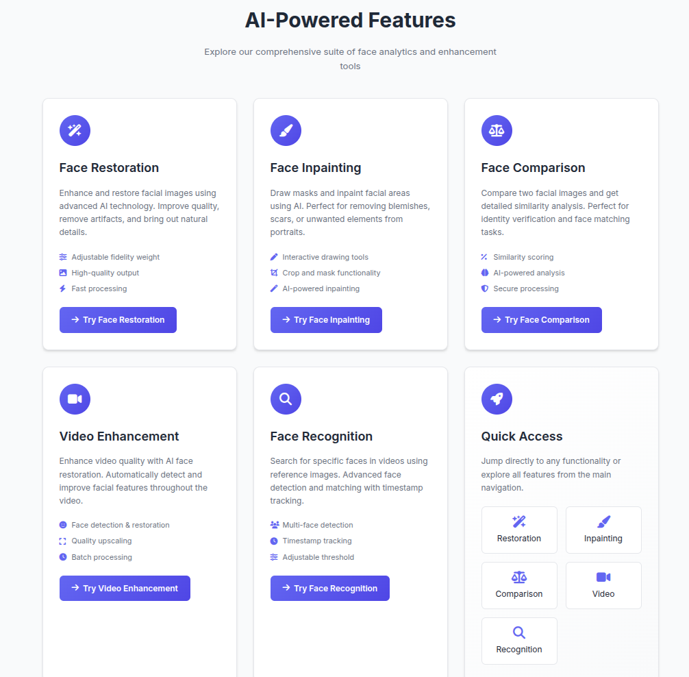
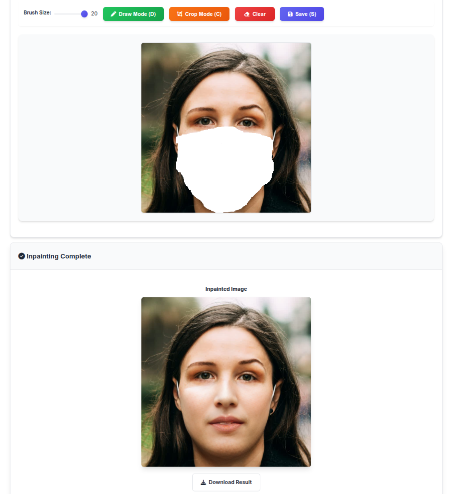
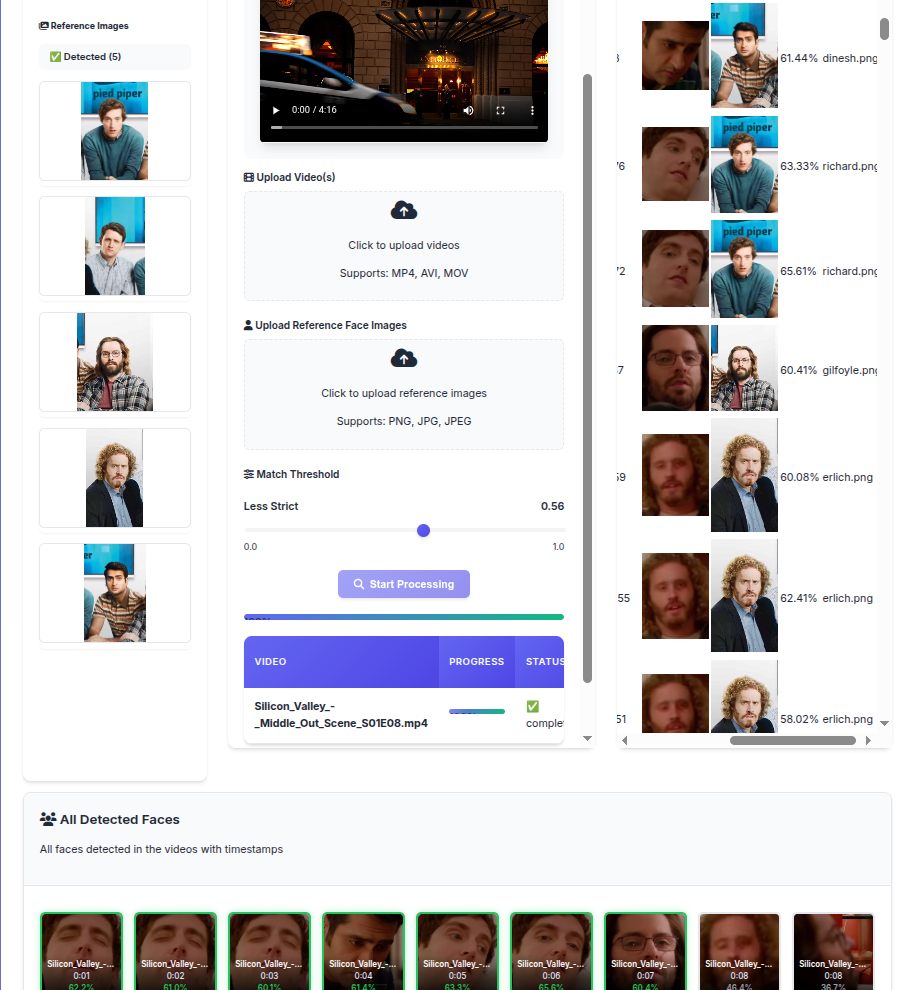

# 🎭 Face Analytics Portal

A comprehensive AI-powered web application for face analytics, restoration, recognition, and enhancement built with CodeFormer and InsightFace technologies.



*Welcome to the Face Analytics Portal - Your gateway to AI-powered face processing*

## 🌟 Features

### 🎨 **Face Restoration**
- **AI-powered face enhancement** using CodeFormer technology
- **Adjustable fidelity weight** (0-1) for natural vs detailed results
- **High-quality output** with artifact removal and detail enhancement
- **Batch processing** support for multiple images
- **Real-time preview** with drag-and-drop interface

### 🖌️ **Face Inpainting**
- **Interactive drawing tools** for mask creation
- **AI-powered inpainting** to fill masked areas
- **Crop and mask functionality** for precise editing
- **Real-time canvas preview** with brush size control
- **Download results** in high quality


*Interactive drawing interface for precise face inpainting with AI-powered restoration*

### ⚖️ **Face Comparison**
- **AI-powered similarity analysis** using InsightFace embeddings
- **Cosine similarity scoring** with percentage results
- **Side-by-side comparison** with visual indicators
- **Secure processing** with local file handling
- **Identity verification** capabilities

### 🎬 **Video Enhancement**
- **AI face restoration** throughout video sequences
- **Automatic face detection** and enhancement
- **Quality upscaling** with RealESRGAN
- **Batch processing** with progress tracking
- **Debug output panel** for monitoring processing
- **Timeout protection** (20-minute limit)

### 🔍 **Face Recognition**
- **Multi-face detection** in videos
- **Reference image matching** with adjustable threshold
- **Timestamp tracking** for each detected face
- **Real-time processing** with progress updates
- **Visual face tiles** with similarity indicators
- **Comprehensive results** with video metadata


*Advanced face recognition system with real-time detection and similarity matching*

## 🚀 Quick Start

### Prerequisites
- **Python 3.8+**
- **CUDA-compatible GPU** (recommended for optimal performance)
- **FFmpeg** (for video processing)
- **Git**

### One-Click Installation

```bash
# Clone the repository
git clone <repository-url>
cd CodeFormerServer2

# Run the installation script
chmod +x install_and_run.sh
./install_and_run.sh
```

The script will:
1. Create a new conda environment called `codeformer`
2. Install all dependencies
3. Download pre-trained models
4. Start the web application

### Manual Installation

```bash
# Create conda environment
conda create -n codeformer python=3.8 -y
conda activate codeformer

# Install PyTorch with CUDA support
conda install pytorch torchvision torchaudio pytorch-cuda=11.8 -c pytorch -c nvidia

# Install FFmpeg
conda install -c conda-forge ffmpeg -y

# Install Python dependencies
pip install -r requirements.txt

# Install additional packages
pip install Flask flask-cors insightface onnxruntime-gpu

# Download pre-trained models
python scripts/download_pretrained_models.py
```

## 📦 Dependencies

### Core AI Frameworks
- **PyTorch 1.7+** - Deep learning framework
- **CodeFormer** - Face restoration and enhancement
- **InsightFace** - Face detection and recognition
- **RealESRGAN** - Image and video upscaling
- **OpenCV** - Computer vision operations

### Web Framework
- **Flask 2.0+** - Web application framework
- **Flask-CORS** - Cross-origin resource sharing

### Additional Libraries
- **NumPy** - Numerical computing
- **Pillow** - Image processing
- **SciPy** - Scientific computing
- **scikit-image** - Image processing algorithms
- **tqdm** - Progress bars
- **requests** - HTTP library
- **yaml** - Configuration files

## 🎯 Usage Guide

### Starting the Application

```bash
# Activate environment
conda activate codeformer

# Start the server
python app.py
```

The application will be available at `http://localhost:5000`

### Face Restoration

1. **Navigate** to the Face Restoration tab
2. **Upload** an image using drag-and-drop or file picker
3. **Adjust** the fidelity weight slider:
   - **Lower values (0-0.5)**: More natural, less detailed
   - **Higher values (0.5-1.0)**: More detailed, potentially less natural
4. **Click** "Restore Face" to process
5. **Download** the enhanced result

### Face Inpainting

1. **Upload** an image to the Inpainting tab
2. **Draw masks** on areas you want to inpaint:
   - Use the brush tool to paint over unwanted areas
   - Adjust brush size as needed
   - Clear canvas to start over
3. **Click** "Inpaint Face" to process
4. **Download** the inpainted result

### Face Comparison

1. **Upload** two images (source and target)
2. **View** the side-by-side comparison
3. **Check** the similarity percentage
4. **Interpret** results:
   - **>80%**: Very likely same person
   - **60-80%**: Possibly same person
   - **<60%**: Likely different people

### Video Enhancement

1. **Upload** a video file (MP4, MOV, AVI)
2. **Monitor** progress in the debug panel
3. **Wait** for processing to complete
4. **Download** the enhanced video

**Note**: Processing time depends on video length and resolution. Use shorter videos for testing.

### Face Recognition

1. **Upload** reference images of the person to find
2. **Upload** video files to search in
3. **Adjust** similarity threshold (default: 0.6)
4. **Start** processing and monitor progress
5. **View** results with timestamps and similarity scores

## 🏗️ Architecture

### Backend Structure
```
CodeFormerServer2/
├── app.py                 # Main Flask application
├── inference_codeformer.py # CodeFormer inference script
├── utils/
│   ├── face_restoration.py # Face restoration utilities
│   ├── face_inpainting.py  # Inpainting utilities
│   ├── face_comparison.py  # Comparison utilities
│   └── models.py          # Model loading utilities
├── basicsr/               # BasicSR framework
├── facelib/               # Face detection library
├── weights/               # Pre-trained models
└── static/                # Static assets
```

### Frontend Structure
```
templates/
├── landing.html          # Landing page
├── index.html            # Face restoration
├── inpainting.html       # Face inpainting
├── compare.html          # Face comparison
├── video_enhancement.html # Video enhancement
└── face_recognition.html # Face recognition
```

## ⚙️ Configuration

### Environment Variables
```bash
# Optional: Set custom upload/output directories
UPLOAD_FOLDER=/path/to/uploads
OUTPUT_FOLDER=/path/to/outputs
```

## 🤖 AI Models and Weights

### Model Storage Structure
```
weights/
├── CodeFormer/           # Face restoration and enhancement models
│   ├── codeformer.pth    # Main CodeFormer model (359MB)
│   └── codeformer_inpainting.pth  # Inpainting model (354MB)
├── facelib/              # Face detection and parsing models
│   ├── detection_Resnet50_Final.pth  # Face detection (104MB)
│   └── parsing_parsenet.pth          # Face parsing (81MB)
├── dlib/                 # Dlib face detection models
│   ├── mmod_human_face_detector-4cb19393.dat      # Face detector (713KB)
│   ├── shape_predictor_5_face_landmarks-c4b1e980.dat   # 5-point landmarks (8.7MB)
│   └── shape_predictor_68_face_landmarks-fbdc2cb8.dat  # 68-point landmarks (95MB)
└── realesrgan/           # RealESRGAN upscaling models
    └── RealESRGAN_x2plus.pth  # 2x upscaling model (64MB)
```

### Model Usage by Feature

#### 🎨 **Face Restoration**
- **Primary Model**: `weights/CodeFormer/codeformer.pth`
- **Purpose**: AI-powered face enhancement and restoration
- **Size**: 359MB
- **Source**: Official CodeFormer release

#### 🖌️ **Face Inpainting**
- **Primary Model**: `weights/CodeFormer/codeformer_inpainting.pth`
- **Purpose**: AI-powered inpainting of masked face areas
- **Size**: 354MB
- **Source**: Official CodeFormer release

#### ⚖️ **Face Comparison**
- **Primary Model**: InsightFace (automatically downloaded)
- **Purpose**: Face embedding generation and similarity analysis
- **Location**: `~/.insightface/models/buffalo_l/`
- **Size**: ~500MB (downloaded automatically)

#### 🎬 **Video Enhancement**
- **Face Model**: `weights/CodeFormer/codeformer.pth`
- **Upscaling Model**: `weights/realesrgan/RealESRGAN_x2plus.pth`
- **Face Detection**: `weights/facelib/detection_Resnet50_Final.pth`
- **Purpose**: Face restoration + background upscaling

#### 🔍 **Face Recognition**
- **Detection Model**: `weights/facelib/detection_Resnet50_Final.pth`
- **Parsing Model**: `weights/facelib/parsing_parsenet.pth`
- **Recognition Model**: InsightFace (automatically downloaded)
- **Purpose**: Face detection, parsing, and recognition

### Model Download

#### Automatic Download (Recommended)
```bash
# Download all models
python scripts/download_pretrained_models.py all

# Download specific models
python scripts/download_pretrained_models.py CodeFormer
python scripts/download_pretrained_models.py facelib
python scripts/download_pretrained_models.py dlib
```

#### Manual Download
```bash
# Create directories
mkdir -p weights/CodeFormer weights/facelib weights/dlib weights/realesrgan

# Download CodeFormer models
wget -O weights/CodeFormer/codeformer.pth https://github.com/sczhou/CodeFormer/releases/download/v0.1.0/codeformer.pth
wget -O weights/CodeFormer/codeformer_inpainting.pth https://github.com/sczhou/CodeFormer/releases/download/v0.1.0/codeformer_inpainting.pth

# Download facelib models
wget -O weights/facelib/detection_Resnet50_Final.pth https://github.com/sczhou/CodeFormer/releases/download/v0.1.0/detection_Resnet50_Final.pth
wget -O weights/facelib/parsing_parsenet.pth https://github.com/sczhou/CodeFormer/releases/download/v0.1.0/parsing_parsenet.pth

# Download dlib models
wget -O weights/dlib/mmod_human_face_detector-4cb19393.dat https://github.com/sczhou/CodeFormer/releases/download/v0.1.0/mmod_human_face_detector-4cb19393.dat
wget -O weights/dlib/shape_predictor_5_face_landmarks-c4b1e980.dat https://github.com/sczhou/CodeFormer/releases/download/v0.1.0/shape_predictor_5_face_landmarks-c4b1e980.dat
wget -O weights/dlib/shape_predictor_68_face_landmarks-fbdc2cb8.dat https://github.com/sczhou/CodeFormer/releases/download/v0.1.0/shape_predictor_68_face_landmarks-fbdc2cb8.dat

# Download RealESRGAN model
wget -O weights/realesrgan/RealESRGAN_x2plus.pth https://github.com/xinntao/Real-ESRGAN/releases/download/v0.2.1/RealESRGAN_x2plus.pth
```

### Model Configuration
- **CodeFormer**: Located in `weights/CodeFormer/`
- **InsightFace**: Automatically downloaded on first use
- **RealESRGAN**: Located in `weights/realesrgan/`
- **Face Detection**: Located in `weights/facelib/` and `weights/dlib/`

## 🔧 Troubleshooting

### Common Issues

**CUDA Out of Memory**
```bash
# Reduce batch size or use CPU
export CUDA_VISIBLE_DEVICES=""
```

**FFmpeg Errors**
```bash
# Reinstall FFmpeg from conda-forge
conda install -c conda-forge ffmpeg -y
```

**Model Download Issues**
```bash
# Manual model download
python scripts/download_pretrained_models.py all

# Or download specific models
python scripts/download_pretrained_models.py CodeFormer
python scripts/download_pretrained_models.py facelib
python scripts/download_pretrained_models.py dlib

# Using wget (if Python script fails)
wget -O weights/CodeFormer/codeformer.pth https://github.com/sczhou/CodeFormer/releases/download/v0.1.0/codeformer.pth
```

**Model Verification**
```bash
# Quick verification script
python verify_models.py

# Manual verification
ls -la weights/CodeFormer/
ls -la weights/facelib/
ls -la weights/dlib/
ls -la weights/realesrgan/

# Expected files:
# CodeFormer: codeformer.pth (359MB), codeformer_inpainting.pth (354MB)
# facelib: detection_Resnet50_Final.pth (104MB), parsing_parsenet.pth (81MB)
# dlib: 3 .dat files (~104MB total)
# realesrgan: RealESRGAN_x2plus.pth (64MB)
```

**Port Already in Use**
```bash
# Change port in app.py
app.run(host='0.0.0.0', port=5001, debug=True)
```

### Performance Optimization

1. **GPU Usage**: Ensure CUDA is properly installed
2. **Memory**: Close other applications during processing
3. **Batch Size**: Reduce for lower memory usage
4. **Video Length**: Use shorter videos for faster processing

## 📊 Performance Metrics

### Processing Times (RTX 3080)
- **Face Restoration**: 2-5 seconds per image
- **Face Inpainting**: 3-8 seconds per image
- **Face Comparison**: 1-2 seconds per pair
- **Video Enhancement**: 30-60 seconds per minute of video
- **Face Recognition**: 10-20 seconds per minute of video

### Memory Requirements
- **Minimum**: 8GB RAM
- **Recommended**: 16GB+ RAM
- **GPU Memory**: 6GB+ VRAM

### Disk Space Requirements
- **AI Models**: ~1.2GB (all models combined)
- **Application**: ~500MB
- **Total**: ~2GB minimum free space
- **Recommended**: 5GB+ for processing results and temporary files

## 🤝 Contributing

1. **Fork** the repository
2. **Create** a feature branch
3. **Make** your changes
4. **Test** thoroughly
5. **Submit** a pull request

## 📄 License

This project is licensed under the MIT License - see the [LICENSE](LICENSE) file for details.

## 🙏 Credits

### Core Technologies
- **[CodeFormer](https://github.com/sczhou/CodeFormer)** - Face restoration and enhancement
  - **Authors**: Shangchen Zhou, Kelvin C.K. Chan, Chongyi Li, Chen Change Loy
  - **Paper**: "Towards Robust Blind Face Restoration with Codebook Lookup Transformer"
  - **License**: MIT License

- **[InsightFace](https://github.com/deepinsight/insightface)** - Face recognition and analysis
  - **Authors**: Jiankang Deng, Jia Guo, Niannan Xue, Stefanos Zafeiriou
  - **Paper**: "ArcFace: Additive Angular Margin Loss for Deep Face Recognition"
  - **License**: MIT License

- **[RealESRGAN](https://github.com/xinntao/Real-ESRGAN)** - Image and video upscaling
  - **Authors**: Xintao Wang, Liangbin Xie, Chao Dong, Ying Shan
  - **Paper**: "Real-ESRGAN: Training Real-World Blind Super-Resolution with Pure Synthetic Data"
  - **License**: BSD 3-Clause License

### Additional Libraries
- **[BasicSR](https://github.com/XPixelGroup/BasicSR)** - Open source image and video restoration toolbox
- **[Flask](https://flask.palletsprojects.com/)** - Web framework for Python
- **[OpenCV](https://opencv.org/)** - Computer vision library

### UI/UX
- **[Font Awesome](https://fontawesome.com/)** - Icons
- **[Inter Font](https://rsms.me/inter/)** - Typography
- **[Bootstrap-inspired CSS](https://getbootstrap.com/)** - Styling framework

## 📞 Support

For issues and questions:
1. **Check** the troubleshooting section
2. **Search** existing issues
3. **Create** a new issue with detailed information

## 🔄 Updates

### Version History
- **v1.0.0**: Initial release with all core features
- **v1.1.0**: Added landing page and improved UI
- **v1.2.0**: Enhanced video processing with debug logs

### Roadmap
- [ ] API endpoints for external integration
- [ ] Advanced face editing tools

---

**Built with ❤️ using state-of-the-art AI technologies**